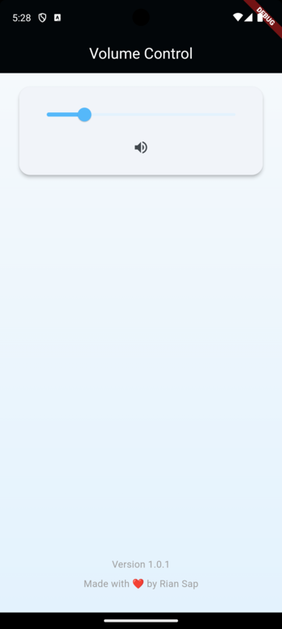

# Volume Control App

A Flutter application that provides a clean and modern interface for controlling device volume.

This application serves as a practical example of how to implement a volume control app using the volume_controller package.

My phone volume buttons are broken so I built this app to control my phone's volume using a slider. I hope it can help others too. 😊



## Features

- Intuitive volume control with a modern UI
- Real-time volume level display
- Mute/unmute functionality
- Version display

## Project Structure

```
lib/
├── models/
│   └── volume.dart
├── screens/
│   └── volume_control_screen.dart
├── utils/
│   └── styles.dart
└── main.dart
```

### Key Components

- **models/volume.dart**: Manages the volume control logic using the `volume_controller` package. It handles volume changes, mute states, and notifies listeners of updates using ChangeNotifier.

- **screens/volume_control_screen.dart**: The main interface of the app, featuring a slider for volume control and a mute toggle button. It also displays the app version.

- **utils/styles.dart**: Contains app-wide styling constants including colors, text styles, spacing, and theme configuration.

## Getting Started

1. **Prerequisites**

   - Flutter SDK (>=3.4.1)
   - Dart SDK (>=3.4.1)
   - Android Studio / VS Code with Flutter extensions

2. **Installation**

   ```bash
   # Clone the repository
   git clone https://github.com/riansap/volumecontrolflutter.git

   # Navigate to project directory
   cd volumeapp

   # Install dependencies
   flutter pub get
   ```

3. **Running the App**
   ```bash
   flutter run
   ```

## Dependencies

- **volume_controller**: For platform-specific volume control
- **package_info_plus**: App version information
- **flutter_launcher_icons**: Custom app icon support

## Contributing

Contributions are welcome! Please feel free to submit a Pull Request.

## License

This project is licensed under the MIT License - see the LICENSE file for details.
